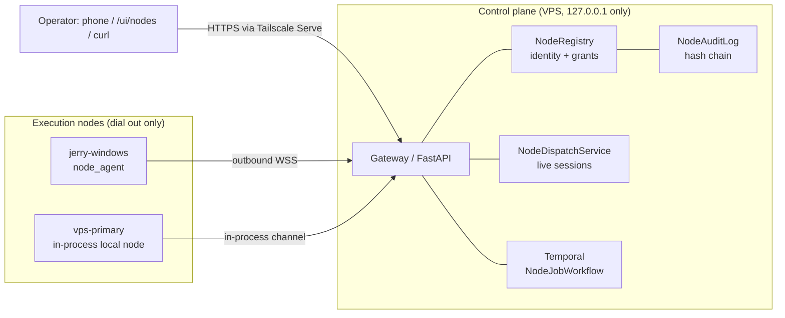

# Olympus Execution Node Mesh — Operator Runbook

**Status:** Slice implemented, not deployed

**Date:** 2026-08-01

**Owner:** Jerry

**Scope:** `src/olympus/nodes/`, `src/olympus/node_agent/`,
`src/olympus/gateway/nodes_api.py`, `src/olympus/workflows/node_job.py`,
`src/olympus/activities/node_dispatch.py`, `src/olympus/runtime/node_edge.py`,
`deploy/node/windows/`

**Parent specification:**
`docs/superpowers/specs/2026-07-28-agentic-vps-god-agent-design.md`
(Sections 14.1, 16, 22)

**Nothing in this document has been deployed, run, or verified against a live
VPS.** It records what the code in the repository does today and the exact
operator actions required to bring it up.

## 1. Purpose and scope

The node mesh lets the Olympus control plane dispatch a single bounded,
read-only capability — `system.inspect@1` — to enrolled Windows and Linux
machines that connect outbound over a private WebSocket. It is the first
slice of the "execution node" concept described in the god-agent design: a
control plane that owns identity, policy, and durable state, and nodes that
hold only the capabilities they are explicitly granted.

This slice does **not** provide:

- Shell access of any kind (`shell.powershell@1` is defined in the capability
  catalog but its status is `reserved`, not `enabled`).
- File read or write (`fs.read@1`, `fs.write@1`, both reserved).
- Browser control (`browser.session@1`, reserved).
- A local Claude Code or Codex session on a node (`agent.claude@1`,
  `agent.codex@1`, both reserved).
- Desktop streaming or takeover (`desktop.stream@1`, `desktop.takeover@1`,
  both reserved).

Every reserved capability is present in `CAPABILITY_CATALOG`
(`src/olympus/nodes/capabilities.py`) so its shape, risk class, and output
trust label are fixed in advance, but `require_dispatchable_capability`
raises `NodeReason.CAPABILITY_RESERVED` for all of them. Only
`system.inspect@1` has `CapabilityStatus.ENABLED`. It reads a fixed set of
non-sensitive host counters (OS, CPU, memory, disk, uptime, agent uptime) via
`SystemInspectProvider` in `src/olympus/node_agent/capabilities.py`. It opens
no file, reads no environment variable, and spawns no subprocess.

Durable state is also partial today. Temporal orchestrates the one-job
workflow (`NodeJobWorkflow`), but the node registry, enrollment tokens, and
the audit chain live in `InMemoryNodeRegistryStore` and `NodeAuditLog`
(`src/olympus/nodes/registry.py`, `src/olympus/nodes/audit.py`) — both are
process-local. A gateway restart forgets every enrolled node, every issued
token, and every audit event. PostgreSQL is not installed and is not wired
in; the code comments call this out explicitly ("PostgreSQL becomes the
canonical owner in the persistence slice").

## 2. Architecture at a glance

The control plane is the sole owner of node identity, capability grants,
Temporal workflow state, and the audit trail. A node holds only its own
Ed25519 private key and the capability providers it was built with, and it
always dials out — it never accepts an inbound connection
(`open_session_channel` in `src/olympus/node_agent/transport.py`; the
Windows installer's own docstring states the Scheduled Task "never opens an
inbound firewall port and never creates a listening socket").

Phone (via the mobile-friendly `/ui/nodes` console) and Discord are command
and observation surfaces. Neither is, or ever becomes, an execution node:
they hold an operator credential and issue HTTP calls against the gateway,
the same way any other operator client would.



The gateway binds `127.0.0.1` only
(`GatewaySettings.http_host: Literal["127.0.0.1"]` in
`src/olympus/gateway/settings.py`), so the only way anything off-box reaches
it — the operator's phone, or a node on another machine — is through
Tailscale Serve terminating TLS and forwarding to that loopback port.

## 3. Installation

### VPS side

The control plane and the node-mesh edge worker run in one process:
`src/olympus/runtime/node_edge.py:run()`. It connects to Temporal, builds the
FastAPI app with the node routes mounted (`create_app(..., node_mesh=runtime)`
in `src/olympus/gateway/app.py`), and runs two Temporal workers in the same
process — one for `CommandWorkflow` on `temporal_task_queue`, one for
`NodeJobWorkflow` on `node_task_queue` — alongside the HTTP server.

Relevant `.env` variables (`GatewaySettings`, env prefix `OLYMPUS_`):

| Variable | Purpose |
| --- | --- |
| `OLYMPUS_ENVIRONMENT` | `development` or `test`. |
| `OLYMPUS_DEV_COMMAND_TOKEN` | Shared development bearer credential (32–256 visible-ASCII characters). Required by `require_operator`. |
| `OLYMPUS_TEMPORAL_ADDRESS` | Temporal frontend address. Defaults to `127.0.0.1:7233`. |
| `OLYMPUS_TEMPORAL_TASK_QUEUE` | Command-workflow task queue. |
| `OLYMPUS_HTTP_PORT` | Gateway listen port. Defaults to `8080`. |
| `OLYMPUS_NODE_TASK_QUEUE` | Node-job workflow task queue. Defaults to `olympus-node-edge-v1`. |
| `OLYMPUS_NODE_HEARTBEAT_INTERVAL_SECONDS` / `OLYMPUS_NODE_HEARTBEAT_EXPIRY_SECONDS` | Session liveness bounds. Defaults `15` / `45`. Expiry must exceed the interval. |
| `OLYMPUS_NODE_ENROLLMENT_TTL_SECONDS` | Default enrollment-token lifetime. Defaults `900`, bounded to `[60, 3600]`. |
| `OLYMPUS_NODE_CONTROL_PLANE_KEY_ID` | Identifier the control plane presents for its signing key. Defaults `olympus-control-plane-v1`. |
| `OLYMPUS_NODE_CONTROL_PLANE_PRIVATE_KEY` | The control plane's Ed25519 private key, base64url-encoded. |
| `OLYMPUS_NODE_MESH_ENABLED` | Must be `true` to run the mesh runtime. Defaults to `false`. |
| `OLYMPUS_NODE_ATTACH_CONTROL_PLANE_HOST` | Enroll the VPS itself as an execution node granted only `system.inspect@1`. Defaults to `true`. |
| `OLYMPUS_NODE_CONTROL_PLANE_HOST_NAME` | Display name for that self node. Defaults to `vps-primary`. |

The control-plane host enrolls itself through the same token flow over an
in-process channel (`attach_local_node` in `src/olympus/nodes/local_node.py`),
so "inspect the VPS" and "inspect my PC" are the same operation. It is granted
only `system.inspect@1`.

`build_edge_app` refuses to start when `OLYMPUS_NODE_MESH_ENABLED` is not set,
because that entrypoint exists only to serve the mesh. Run
`python -m olympus.runtime.gateway` for the command-only gateway and
`python -m olympus.runtime.node_edge` once the mesh is switched on. The flag is
a deployment switch, not an authorization control: freezing dispatch, not
disabling the flag, is the emergency response.

**Signing key.** `resolve_control_plane_keys` in `src/olympus/runtime/
node_edge.py` reads `OLYMPUS_NODE_CONTROL_PLANE_PRIVATE_KEY`. If it is unset,
the gateway **generates a fresh ephemeral Ed25519 key pair on every
process start**. This is explicitly documented in the function's own
docstring as a development convenience, not a safe default: every node that
already enrolled pinned the *previous* control-plane public key during its
handshake (`AgentIdentity.control_plane_public_key`), and
`NodeAgent.handshake` verifies the challenge's `server_proof` against that
pinned key (`verify_payload(..., NodeReason.SERVER_PROOF_INVALID)`). A
restart with a new ephemeral key means every previously enrolled node fails
its next handshake with `server-proof-invalid` and cannot reconnect until it
re-enrolls. **Set `OLYMPUS_NODE_CONTROL_PLANE_PRIVATE_KEY` before enrolling
any real node.** Generate one with:

```bash
python -c "from olympus.nodes.crypto import generate_node_keypair as g; k = g(); print(k.private_key)"
```

Store the resulting value as `OLYMPUS_NODE_CONTROL_PLANE_PRIVATE_KEY` in the
VPS `.env`. Treat it as a credential: it is never committed to Git.

### Windows side

Prerequisites, from `deploy/node/windows/README.md`:

- Windows 10/11, PowerShell 5.1+.
- Python 3.13 on `PATH` (as `py -3.13` or `python3.13`) or passed via
  `-PythonExe`. The installer does not install Python.
- The machine has joined tailnet `tail70f263.ts.net` and can reach
  `vps-41e741fc.tail70f263.ts.net`. `jerry-windows` is already on this
  tailnet at `100.69.154.76`.
- A single-use enrollment token issued by the control-plane operator
  (Section 4).

Build the wheel on the VPS, from the repository root:

```bash
uv build
```

This produces `dist/olympus-<version>-py3-none-any.whl`. Copy that wheel and
the contents of `deploy/node/windows/` (`Install-OlympusNode.ps1` and
`requirements-node.txt`) to the Windows machine, e.g. `C:\temp\olympus-node\`.
`requirements-node.txt` is a hash-pinned subset of the project's dependency
export containing only what the node agent imports at runtime
(`cryptography`, `websockets`, `pydantic`, and their transitive
dependencies) — not FastAPI, Temporal, or the rest of the control-plane
stack.

Invocation (see Section 4 for the enrollment token itself):

```powershell
.\Install-OlympusNode.ps1 `
  -ControlPlaneUrl "https://vps-41e741fc.tail70f263.ts.net" `
  -EnrollmentToken (Read-Host -AsSecureString "Enrollment token") `
  -NodeName "jerry-windows" `
  -PackagePath "C:\temp\olympus-node\olympus-0.1.0-py3-none-any.whl"
```

The script requires elevation only because the default `-InstallRoot`
(`$env:ProgramData\Olympus\node`) is under `ProgramData`; it locks that tree
down with `icacls /inheritance:r` to the owning user, `SYSTEM`, and
`Administrators` (the config file holds the node's private key). It creates
a venv, installs the hash-pinned dependencies plus the wheel with
`--no-deps`, runs `enroll`, writes a `.cmd` wrapper, and registers a
Scheduled Task (`OlympusNodeAgent`, triggers `AtStartup` and `AtLogOn`,
`RunLevel Limited`) that runs `olympus.node_agent run`. It never calls
`New-NetFirewallRule` and opens no listening socket.

## 4. Enrollment

Enrollment is a two-step handshake: the operator issues a single-use token
scoped to one node name, kind, platform, and capability grant; the node
redeems it once, generating its own key pair locally and never transmitting
the private half.

**1. Issue a token** (`POST /v1/nodes/enrollments`, requires the operator
headers described in Section 5):

```bash
curl -sS -X POST "https://vps-41e741fc.tail70f263.ts.net/v1/nodes/enrollments" \
  -H "Authorization: Bearer $OLYMPUS_DEV_COMMAND_TOKEN" \
  -H "X-Olympus-Commander: jerry" \
  -H "X-Olympus-Authority-Lease: <lease-id>" \
  -H "Content-Type: application/json" \
  -d '{
        "node_name": "jerry-windows",
        "kind": "workstation",
        "platform": "windows",
        "capabilities": ["system.inspect@1"],
        "ttl_seconds": 900
      }'
```

```powershell
$headers = @{
  "Authorization"              = "Bearer $env:OLYMPUS_DEV_COMMAND_TOKEN"
  "X-Olympus-Commander"        = "jerry"
  "X-Olympus-Authority-Lease"  = "<lease-id>"
}
$body = @{
  node_name    = "jerry-windows"
  kind         = "workstation"
  platform     = "windows"
  capabilities = @("system.inspect@1")
  ttl_seconds  = 900
} | ConvertTo-Json
Invoke-RestMethod -Method Post `
  -Uri "https://vps-41e741fc.tail70f263.ts.net/v1/nodes/enrollments" `
  -Headers $headers -Body $body -ContentType "application/json"
```

The response (`IssuedEnrollmentResponse`) carries `enrollment_token` — the
presented secret, shaped `olynode_<token_id>_<secret>` — plus `token_id`,
`granted_capabilities`, and `expires_at`. **This is the only time the secret
is shown.** `NodeRegistryStore` never stores the presented value, only
`secret_hash = hash_enrollment_secret(token_id, secret_value)`
(`src/olympus/nodes/crypto.py`), a SHA-256 hash domain-separated with
`b"olympus-node-enrollment-v1"`.

The token is:

- **Single-use.** `redeem_enrollment_token` checks `record.consumed` and
  raises `NodeReason.ENROLLMENT_CONSUMED` on a second redemption attempt
  (`src/olympus/nodes/registry.py`). A retried redemption from the *same*
  public key that already succeeded is recognized as the same enrollment and
  returns the existing node record rather than failing — this covers a
  client retry after a dropped response, not a second real device.
- **Short-lived.** Default TTL is `OLYMPUS_NODE_ENROLLMENT_TTL_SECONDS`
  (900s), and the API bounds any override to `[60, 3600]` seconds
  (`IssueEnrollmentRequest.ttl_seconds`, `MIN_ENROLLMENT_TTL_SECONDS` /
  `MAX_ENROLLMENT_TTL_SECONDS`). This limits the window in which a leaked
  token is useful and forces routine re-issuance rather than long-lived
  standing credentials.
- **Scope-checked at redemption.** `_enrollment_failure` rejects a
  redemption whose `node_name`, `platform`, or `kind` does not match what
  was granted, with `NodeReason.ENROLLMENT_SCOPE_MISMATCH`.

**2. Redeem it.** The Windows installer does this for you via
`Invoke-Enrollment`, which calls:

```powershell
python -m olympus.node_agent enroll `
  --control-plane-url "https://vps-41e741fc.tail70f263.ts.net" `
  --enrollment-token "olynode_<token_id>_<secret>" `
  --node-name "jerry-windows" `
  --kind workstation `
  --config "C:\ProgramData\Olympus\node\config.json"
```

This is the exact PowerShell one-liner Jerry runs on `jerry-windows`
(wrapped by the installer, or standalone if the agent is already unpacked).
`command_enroll` (`src/olympus/node_agent/__main__.py`) generates an Ed25519
key pair locally (`generate_node_keypair`), POSTs `{enrollment_token,
public_key, node_name, kind, platform, architecture, agent_version,
declared_capabilities}` to `/v1/nodes/enroll`, and on success writes
`config.json` with `save_config` — owner-only file permissions
(`stat.S_IRUSR | stat.S_IWUSR`), private key included, enrollment token
discarded. The token is read from `--enrollment-token` or stdin
(`--enrollment-token-stdin`) specifically so it never has to be embedded in
a script that gets logged; it is not persisted to `config.json` or any log.

## 5. Day-two operation

All operator endpoints require three headers: `Authorization: Bearer
<OLYMPUS_DEV_COMMAND_TOKEN>`, `X-Olympus-Commander`, and
`X-Olympus-Authority-Lease` (`require_operator` in
`src/olympus/gateway/auth.py`). This is explicitly the development-slice
boundary; the docstring notes the trusted-ingress slice replaces the shared
token with a Face-ID-issued server-side lease without changing the
`DispatchAuthority` shape.

**List nodes:**

```bash
curl -sS "https://vps-41e741fc.tail70f263.ts.net/v1/nodes" \
  -H "Authorization: Bearer $OLYMPUS_DEV_COMMAND_TOKEN" \
  -H "X-Olympus-Commander: jerry" \
  -H "X-Olympus-Authority-Lease: <lease-id>"
```

**Mobile console:** `GET /ui/nodes` serves a self-contained HTML/JS shell
(`render_node_console`, `src/olympus/gateway/ui.py`) with no embedded data
and no credential baked in — the operator pastes the bearer credential,
commander, and lease into the page, held only in `sessionStorage`. It polls
`/v1/nodes` and `/v1/nodes/jobs` every five seconds and lets you dispatch a
capability, freeze, and unfreeze from the browser.

**Dispatch a job:**

```bash
curl -sS -X POST "https://vps-41e741fc.tail70f263.ts.net/v1/nodes/jobs" \
  -H "Authorization: Bearer $OLYMPUS_DEV_COMMAND_TOKEN" \
  -H "X-Olympus-Commander: jerry" \
  -H "X-Olympus-Authority-Lease: <lease-id>" \
  -H "Content-Type: application/json" \
  -d '{"capability": "system.inspect@1", "parameters": {}, "node_id": null}'
```

`node_id` is optional; when omitted, `NodeRegistry.select_node` picks the
least-loaded online node that offers the capability
(`src/olympus/nodes/registry.py`). The response (`JobAcceptedResponse`)
returns `job_id` and `workflow_id` immediately — dispatch starts a Temporal
`NodeJobWorkflow` and returns before the node finishes.

**Watch progress:**

```bash
curl -sS "https://vps-41e741fc.tail70f263.ts.net/v1/nodes/jobs" \
  -H "Authorization: Bearer $OLYMPUS_DEV_COMMAND_TOKEN" \
  -H "X-Olympus-Commander: jerry" \
  -H "X-Olympus-Authority-Lease: <lease-id>"
```

Each `JobResponse` carries `status`, `progress_events`, and `last_message`,
updated as `job-progress` frames arrive over the node's live WebSocket
session (`NodeDispatchService._progress_recorder`).

**Cancel a job:**

```bash
curl -sS -X POST \
  "https://vps-41e741fc.tail70f263.ts.net/v1/nodes/jobs/<job_id>/cancel" \
  -H "Authorization: Bearer $OLYMPUS_DEV_COMMAND_TOKEN" \
  -H "X-Olympus-Commander: jerry" \
  -H "X-Olympus-Authority-Lease: <lease-id>" \
  -H "Content-Type: application/json" \
  -d '{"reason": "operator requested"}'
```

This both signals `NodeJobWorkflow.request_cancellation` and calls
`NodeDispatchService.cancel_job`, which sends a `job-cancel` frame to
whichever live session currently holds the job. The node still returns a
terminal `job-result` frame with status `cancelled`.

**Read the audit chain:**

```bash
curl -sS "https://vps-41e741fc.tail70f263.ts.net/v1/nodes/audit?limit=100" \
  -H "Authorization: Bearer $OLYMPUS_DEV_COMMAND_TOKEN" \
  -H "X-Olympus-Commander: jerry" \
  -H "X-Olympus-Authority-Lease: <lease-id>"
```

`AuditResponse` includes `chain_valid` — the result of `NodeAuditLog.verify()`
recomputing every hash link — and the requested tail of events (`limit`
capped to `[1, 500]`). Every event carries `payload_digest`, `previous_hash`,
and `event_hash`, chained from a genesis hash of all zeros
(`src/olympus/nodes/audit.py`).

## 6. Emergency controls

**Freeze** halts every new dispatch mesh-wide:

```bash
curl -sS -X POST "https://vps-41e741fc.tail70f263.ts.net/v1/nodes/control/freeze" \
  -H "Authorization: Bearer $OLYMPUS_DEV_COMMAND_TOKEN" \
  -H "X-Olympus-Commander: jerry" \
  -H "X-Olympus-Authority-Lease: <lease-id>" \
  -H "Content-Type: application/json" \
  -d '{"reason": "incident"}'
```

`NodeRegistry.freeze_dispatch` is idempotent: calling it while already
frozen returns the current `DispatchControlState` unchanged rather than
bumping the epoch or erroring. `NodeDispatchService.freeze` also walks every
job the dispatch service still tracks as non-terminal
(`active_job_ids()`) and calls `cancel_job` on each — **freezing cancels
every in-flight job**, it does not merely block new ones.

**Unfreeze** requires naming the exact current freeze epoch:

```bash
curl -sS -X POST "https://vps-41e741fc.tail70f263.ts.net/v1/nodes/control/unfreeze" \
  -H "Authorization: Bearer $OLYMPUS_DEV_COMMAND_TOKEN" \
  -H "X-Olympus-Commander: jerry" \
  -H "X-Olympus-Authority-Lease: <lease-id>" \
  -H "Content-Type: application/json" \
  -d '{"expected_freeze_epoch": 3, "reason": "incident resolved"}'
```

`unfreeze_dispatch` raises `NodeReason.FREEZE_EPOCH_MISMATCH` if
`expected_freeze_epoch` does not equal `control.freeze_epoch` exactly, and
`NodeReason.NOT_FROZEN` if dispatch is not currently frozen at all. Fetch
the current epoch from `GET /v1/nodes/control` first. This means an
unfreeze can never accidentally clear a *later* freeze than the one the
caller observed — a stale unfreeze request from an old incident cannot
silently thaw a fresh one.

**Quarantine** and **revocation** are both scoped to one node, not
mesh-wide:

```bash
curl -sS -X POST \
  "https://vps-41e741fc.tail70f263.ts.net/v1/nodes/<node_id>/quarantine" \
  -H "Authorization: Bearer $OLYMPUS_DEV_COMMAND_TOKEN" \
  -H "X-Olympus-Commander: jerry" \
  -H "X-Olympus-Authority-Lease: <lease-id>" \
  -H "Content-Type: application/json" \
  -d '{"reason": "suspicious health report"}'
```

Quarantine stops the node from being selected for new dispatch
(`assert_dispatchable` raises `NodeReason.NODE_QUARANTINED`) without closing
its live session, so it can still heartbeat and be observed. `restore`
reverses it (blocked if the node is revoked). `revoke` is permanent —
`revoke_node` sets `revoked_at` once and it is never cleared — and also
tears down any live session immediately (`session.shutdown(reason=
NodeReason.NODE_REVOKED.value)` in `nodes_api.py`).

## 7. Threat model

| Adversary / scenario | Mechanism that addresses it |
| --- | --- |
| Stolen enrollment token | Single-use (`EnrollmentTokenRecord.consumed`), short TTL (`[60, 3600]`s, default 900s), scoped to one node name/kind/platform. Operator can revoke an unconsumed token with `DELETE /v1/nodes/enrollments/{token_id}` before it is used. |
| Replayed enrollment (same token reused) | `_enrollment_failure` in `registry.py` returns `ENROLLMENT_CONSUMED` on any redemption after the first succeeds, except a byte-identical retry from the same already-registered public key, which returns the existing record rather than minting a second node. |
| Compromised node lying about its own capabilities or health | Declared capabilities are intersected with the control-plane grant and the enabled catalog in `NodeRegistry.effective_capabilities` — a node cannot widen what it may run by declaring more. Health (`NodeHealthReport`) is explicitly documented as untrusted and only affects load-balancing (`_active_jobs`), never admission. |
| A node impersonating another node | Session handshake binds `node_id` to a registered `NodeRecord.public_key` and requires an Ed25519 signature over `node_proof_payload` (which includes `session_id`, `node_id`, `server_nonce`) verified against that stored key (`NodeSession._handshake` in `src/olympus/nodes/session.py`). A node without the matching private key cannot complete the handshake for another node's identity. |
| A rogue server impersonating the control plane | The node verifies `server_proof_payload` against `control_plane_public_key` pinned at enrollment time, and separately checks `challenge.control_plane_key_id` matches the pinned key id, before it ever sends its own proof (`NodeAgent.handshake` in `agent.py`). A server without the real control-plane private key fails `SERVER_PROOF_INVALID`. |
| Replayed handshake proofs | Both proofs are bound to a fresh `node_nonce` (client) and `server_nonce` (server) generated per handshake via `random_nonce()` (32 bytes from `secrets.token_bytes`), plus the specific `session_id`. A captured proof from a prior session cannot satisfy a new session's nonce/session_id pair. |
| A node flooding the control plane with output | Every frame is bounded at `MAX_FRAME_BYTES` (256 KiB) by `encode_frame`/`_parse` in `protocol.py`. Job output is separately bounded per capability (`max_output_bytes`, e.g. 16 KiB for `system.inspect@1`) and truncated by `_bound_output` in `agent.py` before it leaves the node. Progress events are capped at `MAX_PROGRESS_EVENTS_PER_JOB` (200) and concurrent jobs per node at `MAX_CONCURRENT_JOBS_PER_NODE` (4). |
| Secrets leaking through job output or audit records | `redact_value`/`redact_text` (`src/olympus/nodes/redaction.py`) strip PEM private keys, `olynode_` tokens, bearer credentials, JWTs, and common cloud-provider credential shapes, plus keyword-anchored assignments like `password=...`, before output is returned to the workflow (`NodeSession._outcome_of`) and before any audit payload is appended (`NodeAuditLog.append`). Redaction runs before truncation (`redact_and_bound`) specifically so truncation cannot cut a secret in half and leave a fragment exposed. |
| A node trying to escalate to shell/root | There is no shell capability to escalate into: `shell.powershell@1` is `CapabilityStatus.RESERVED` and `require_dispatchable_capability` refuses to dispatch any reserved capability regardless of what a node or an operator requests. `SystemInspectProvider` and `LocalSystemProbe` use only the standard library and never call `subprocess`. |
| Loss of the control-plane private key | Every enrolled node pins the corresponding public key and refuses a session whose `server_proof` does not verify against it (`SERVER_PROOF_INVALID`). Recovery requires rotating the key (Section 8) and every node re-enrolling; there is no silent fallback. |
| Loss of a node private key | The node cannot complete a handshake without it (`node_proof` fails to verify). The control-plane-side fix is to revoke that node's identity (Section 8) and issue a fresh enrollment token for a replacement. |

### Residual risks (not yet defended)

- **In-process state loss on restart.** `InMemoryNodeRegistryStore` and
  `NodeAuditLog` hold everything in the gateway process's memory. A restart
  or crash loses every enrolled node record, every issued/consumed
  enrollment token, and the entire audit chain. PostgreSQL is not installed
  on the VPS and is not wired into this slice.
- **No off-host audit export.** The design's Section 16 calls for
  "tamper-evident audit events exported off the VPS." This slice's audit
  chain is tamper-*evident* (hash-linked, `verify_chain` recomputes every
  link) but not exported anywhere; it disappears with the process.
- **No signed policy bundle.** Capability grants and the freeze/quarantine
  controls are enforced in code, but there is no signed, versioned policy
  bundle of the kind Section 16.1 describes, and no separate verification
  key for one.
- **No Face ID binding on unfreeze yet.** Unfreeze requires the correct
  freeze epoch (Section 6) but is authorized by the same shared development
  bearer token as every other operator call — not yet a Face-ID-bound
  approval as the design's authority model calls for at privileged sinks.
- **No mutual TLS pinning beyond the Ed25519 control-plane key.** The
  WebSocket transport relies on Tailscale Serve's TLS termination and the
  application-layer Ed25519 handshake described in Section 7's threat table.
  There is no separate certificate pinning at the TLS layer.

## 8. Revocation and recovery

**Revoke an unconsumed enrollment token** (before it is redeemed):

```bash
curl -sS -X DELETE \
  "https://vps-41e741fc.tail70f263.ts.net/v1/nodes/enrollments/<token_id>" \
  -H "Authorization: Bearer $OLYMPUS_DEV_COMMAND_TOKEN" \
  -H "X-Olympus-Commander: jerry" \
  -H "X-Olympus-Authority-Lease: <lease-id>"
```

`revoke_enrollment_token` is idempotent on an already-revoked token and has
no effect on a token that was already consumed — a redeemed enrollment
becomes a node, and nodes are revoked separately.

**Quarantine a node** — see Section 6. Use this when a node's behavior is
suspicious but you are not yet certain it must be permanently retired;
observation continues, dispatch stops.

**Revoke a node permanently** — see Section 6. `revoke_node` is
irreversible: once `revoked_at` is set it is never cleared by any other
call, `state_of` always reports `NodeState.REVOKED`, and the node's live
session (if any) is torn down immediately. There is no "un-revoke" endpoint.
A machine that must rejoin the mesh after revocation needs a brand new
enrollment token and produces a brand new `node_id`.

**Rotate the control-plane key.** There is no in-place rotation endpoint;
rotation means generating a new key pair with the same command shown in
Section 3, setting `OLYMPUS_NODE_CONTROL_PLANE_PRIVATE_KEY` to the new
value, and restarting the gateway process. Because every enrolled node
pinned the *old* public key at its own enrollment time
(`AgentIdentity.control_plane_public_key` in the node's `config.json`), **the
consequence is that every currently enrolled node fails its next handshake**
with `SERVER_PROOF_INVALID` and stops reconnecting on its own — the node
agent's reconnect loop (`_serve` in `__main__.py`) will keep retrying with
exponential backoff but can never succeed against a control plane presenting
a different key. Every node must be re-enrolled: run `enroll --force` (or
the installer with `-Force`) against each machine with a freshly issued
token after the rotation.

**A Windows machine is lost or stolen.** Revoke that machine's node
immediately (`POST /v1/nodes/{node_id}/revoke`) so its stored private key
can no longer complete a handshake even if the physical disk is later
recovered. The node's private key lives only in `config.json` under
`InstallRoot` (ACL-restricted to the owning user, `SYSTEM`, and
`Administrators` by the installer) — revocation on the control-plane side is
what actually neutralizes it, since there is no remote-wipe mechanism for
the file itself in this slice.

## 9. Next slices

Each of the following moves a reserved capability in `CAPABILITY_CATALOG`
(`src/olympus/nodes/capabilities.py`) to `enabled`. Every one of them
requires Face ID binding and a signed policy bundle before activation — the
design's privileged-sink rule (Section 14.1) and immutable policy supply
chain (Section 16.1) apply to all of them, and none of that machinery exists
yet in this repository.

1. **`shell.powershell@1`** — bounded, allowlisted PowerShell execution.
   Unlocks running specific, pre-approved commands on a node rather than
   read-only inspection. New risk to design first: arbitrary command
   injection through job parameters, and the fact that any shell surface at
   all turns a compromised control-plane session into a compromised host —
   this is exactly the class of action Section 22's invariant 3 (root
   commands require Face ID bound to the exact command digest) is written
   for.
2. **`fs.read@1` / `fs.write@1`** — bounded file access. Unlocks reading and
   writing specific files on the node. New risk: path traversal outside an
   intended root, and write access turning a node into a foothold for
   further compromise (e.g. overwriting the agent's own binary or startup
   configuration).
3. **`agent.claude@1` / `agent.codex@1`** — a local Claude Code or Codex
   session on the node. Unlocks delegating real coding work to the node's
   own machine. New risk: a coding agent has much broader effective reach
   than any single capability (it can itself shell out, read/write files,
   and reach the network), so this capability effectively re-imports every
   risk of the two above plus prompt-injection-driven scope creep — the
   design's trust-label and taint-propagation rules (Section 14.1) exist
   specifically to keep model-derived and external-untrusted content out of
   privileged sinks like this one.
4. **`browser.session@1`** — a governed browser session. This wraps the
   *existing* agentic-chrome runtime at
   `/home/ubuntu/code/agentic-chrome-runtime`, not a new browser stack: its
   operator CLI `agentic-chrome verify`, the flock-based lease commands
   `agentic-browser-lease acquire|release|status`, and its production CDP
   endpoint on `127.0.0.1:9433`. The node worker becomes the only thing that
   touches that lease and that CDP endpoint; the control plane itself never
   sees raw CDP traffic. New risk: browser sessions carry real,
   authenticated Google Workspace state, so this capability must inherit
   the design's rule that "all page content [is] untrusted input" (Section
   14) and that browser workers cannot directly call the root broker —
   plus, specific to this repo, correct interplay with the existing
   `agentic-browser-lease` so a node job can never hold the browser lease
   longer than its job deadline or bypass the watchdog that already
   protects that runtime.
5. **`desktop.stream@1`** — read-only desktop stream. Unlocks watching a
   node's screen. New risk: even read-only, a desktop stream can expose
   credentials, private communications, or other sessions visible on
   screen — it needs the same untrusted-output handling as any other node
   result, plus an explicit operator-visible indicator that the machine is
   being watched.
6. **`desktop.takeover@1`** — interactive desktop takeover. The most
   privileged capability in the catalog (`CapabilityRisk.PRIVILEGED`,
   `mutating=True`, `requires_approval=True`). Unlocks direct interactive
   control of the node's desktop. New risk: this is functionally equivalent
   to remote-desktop access to the machine, so it must be treated with at
   least the scrutiny Section 22 reserves for root broker actions —
   including that it should very likely require a live, freshly re-asserted
   Face ID approval at the moment of takeover, not just at grant time.
