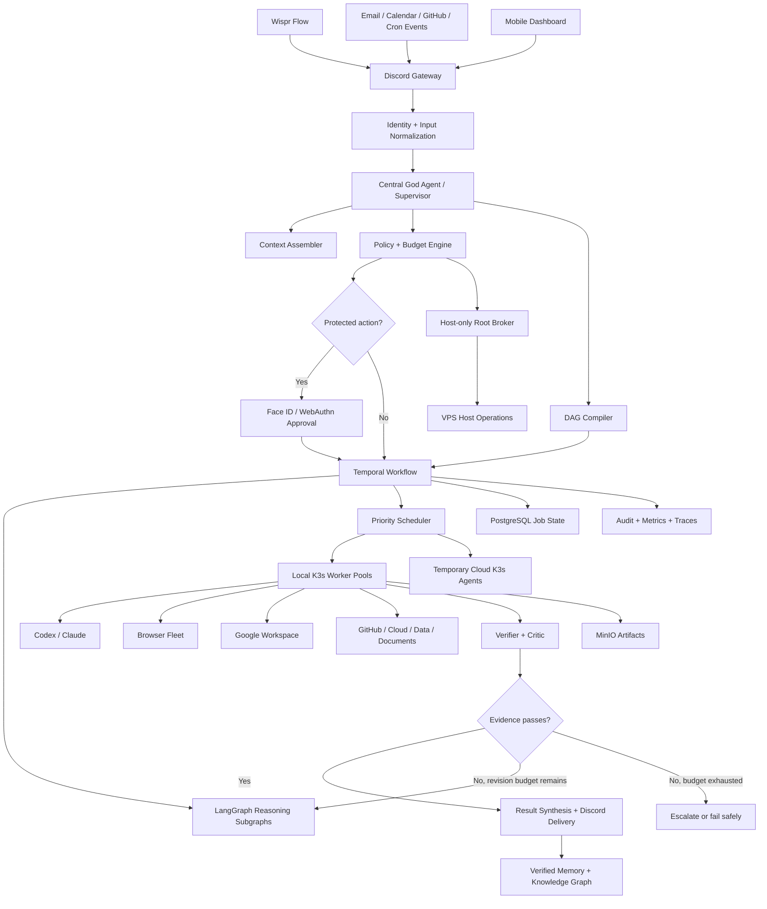

# Agentic VPS God Agent — Design Specification

**Status:** Approved

**Date:** 2026-07-28

**Owner:** Jerry
**Deployment target:** Existing Ubuntu VPS with elastic cloud workers

## 1. Objective

Build an always-on personal orchestration system controlled from Jerry's private 9to5 Discord server. Wispr Flow supplies voice-to-text input on the phone; Discord is the command surface; a durable central agent plans and coordinates work across the VPS, Google Workspace, GitHub, browsers, cloud infrastructure, Codex, Claude, and future integrations.

The system must feel like one coherent "God Agent" while retaining strict technical boundaries around root access, credentials, spending, and irreversible actions.

## 2. Success Criteria

The finished system must:

1. Accept natural-language commands exclusively from Jerry's Discord user ID.
2. Acknowledge accepted commands within two seconds at p95.
3. Compile complex requests into durable, inspectable execution graphs.
4. Run independent graph branches concurrently across local and temporary K3s workers.
5. Resume accepted jobs after worker, process, network, or VPS failures without duplicating external effects.
6. Operate Google Drive, Docs, Sheets, Gmail, Calendar, GitHub, headless browsers, local projects, and cloud infrastructure.
7. Act autonomously for routine work and require Face ID only for catastrophic or explicitly protected actions.
8. Autonomously spend no more than $20 per calendar month and never exceed $50 of incremental monthly infrastructure/API spending.
9. Preserve a tamper-evident audit trail and verified long-term memory.
10. Provide immediate `/freeze`, pause, redirect, inspect, cancel, and recovery controls from the phone.

## 3. Non-goals

- Exposing an unrestricted root shell directly to Discord or an LLM.
- Allowing commands from other Discord users in the first release.
- Giving model-generated content authority merely because it appears in email, Drive, a webpage, an attachment, or another agent's output.
- Running permanent expensive cloud workers when local or temporary capacity is sufficient.
- Building a fully decentralized swarm with no authoritative planner.
- Making Kubernetes the workflow engine or reasoning layer.

## 4. Approved Decisions

| Area | Decision |
|---|---|
| Command surface | Existing private 9to5 Discord server |
| Discord structure | `AGENT OPS` category with dedicated operational channels |
| Authorized commander | Jerry's Discord user ID only |
| Approval mechanism | WebAuthn passkey requiring phone Face ID |
| Autonomy | Nearly fully autonomous; Face ID only for protected actions |
| Autonomous spend | $20 per calendar month |
| Absolute incremental spend | $50 per calendar month |
| Orchestrator | Custom, model-agnostic daemon |
| Execution isolation | K3s worker pods and isolated Git worktrees |
| Privilege model | Non-root orchestrator plus host-only root broker |
| Workflow runtime | Temporal outer workflows |
| Agent reasoning | LangGraph inner subgraphs |
| Models | Claude/Codex subscriptions first; paid APIs as metered fallback |
| Scaling | Existing VPS control plane plus temporary K3s cloud agents |
| Data architecture | Adaptive polyglot layer with one canonical owner per datum |

## 5. System Architecture

### 5.1 Architectural Principle

The user experiences one central agent, but execution is distributed. The supervisor owns the objective, global context, prioritization, delegation, and final synthesis. Specialized workers own narrow tasks. Workers exchange typed events and structured artifacts rather than unbounded conversational chatter.

### 5.2 Graph of Graphs

The production topology contains eight bounded subgraphs:

1. **Ingress graph:** Discord, voice/attachment parsing, webhooks, mailbox/calendar watches, schedules, and dashboard API.
2. **Central intelligence graph:** supervisor, intent classifier, context assembler, strategy selector, DAG compiler, and result synthesizer.
3. **Trust and governance graph:** identity, policy, budget, Face ID, secrets, and privilege mediation.
4. **Durable runtime graph:** event bus, scheduler, dependency resolution, leases, checkpoints, idempotency, model/tool routing, caching, and resource forecasting.
5. **Specialist execution mesh:** planning, research, Codex, Claude, browser, Workspace, GitHub, cloud, communications, data, document, and cleanup workers.
6. **Verification graph:** tests, independent criticism, evidence validation, policy validation, and outcome scoring.
7. **Memory and data graph:** job state, artifacts, semantic index, knowledge graph, curated memory, and audit ledger.
8. **Recovery and operations graph:** retries, revisions, circuit breakers, dead-letter handling, compensation, health control, autoscaling, and observability.

## 6. Discord Experience

### 6.1 Channel Layout

Under the existing server's `AGENT OPS` category:

- `#command-center`: primary natural-language command surface.
- `#approvals`: protected-action cards and Face ID links.
- `#activity`: compact execution milestones.
- `#alerts`: security, failure, budget, and recovery notifications.
- `#projects`: index of active projects and their current state.
- `#agent-admin`: private configuration, freeze, recovery, and policy status.

Existing or newly created project channels such as `#9to5`, `#neurips`, and `#personal-ops` provide project-specific context. Complex commands receive dedicated job threads; quick requests remain inline.

### 6.2 Job Controls

Every complex job thread exposes:

- Inspect graph
- Pause
- Resume
- Redirect
- Add context
- Cancel
- View artifacts
- View cost
- View audit trail

`/freeze` immediately prevents new work and suspends active workers at safe checkpoints. Only a successful Face ID assertion may re-enable privileged execution.

## 7. Job Lifecycle

1. **Capture:** verify Discord user ID, normalize attachments, assign job ID, store original request, and acknowledge.
2. **Context:** retrieve only relevant project, Workspace, GitHub, browser, and memory context with provenance.
3. **Classify:** determine risk, projected cost, expected duration, and quick-path versus durable-graph execution.
4. **Compile:** create a typed DAG with dependencies, conditional branches, resource estimates, deadlines, retry limits, verification requirements, and compensation steps.
5. **Authorize:** automatically authorize routine work; pause protected nodes for a signed Face ID assertion over the exact action digest.
6. **Execute:** schedule ready branches concurrently on capability-matched K3s workers.
7. **Verify:** test outputs and require API receipts, screenshots, diffs, or other domain-specific evidence.
8. **Revise:** rerun only affected branches within bounded revision budgets.
9. **Deliver:** synthesize results, links, artifacts, cost, and a concise audit summary in Discord.
10. **Remember:** store only verified facts, durable preferences, and provenance-backed relationships.

## 8. Workflow and Reasoning Runtimes

### 8.1 Temporal

Temporal is the outer durability layer and owns:

- Accepted job lifecycle
- Long-running timers and schedules
- Activity queues
- Retries and backoff
- Human approval waits
- Compensation and rollback workflows
- Crash recovery
- Cancellation and signals
- Multi-day and recurring workflows

Temporal is the sole owner of workflow execution state.

### 8.2 LangGraph

LangGraph runs inside Temporal activities for:

- Conditional reasoning paths
- Planning and replanning
- Specialist-agent subgraphs
- Bounded tool-use cycles
- Critic and verifier feedback
- Stateful reasoning checkpoints
- Human clarification interrupts that do not require protected authorization

LangGraph does not independently own external side effects. Any side-effecting node must call a Temporal activity with an idempotency key.

## 9. Models and Tool Routing

The router scores candidate executors by capability, latency, cost, rate-limit state, privacy, and current load.

Default policy:

1. Use existing Claude and Codex CLI subscriptions.
2. Use the best matched worker: Codex for repository implementation and review; Claude for long-context reasoning, documents, and general operations; specialized non-LLM code for deterministic work.
3. Use paid APIs only when CLI execution is unavailable, rate-limited, or materially inferior for the task.
4. Cache deterministic and retrieval-heavy results.
5. Charge all paid API use to the same monthly cost governor.

Models never receive raw long-lived credentials. Workers obtain narrow, short-lived capability tokens from the secrets broker.

## 10. Permission and Approval Model

### 10.1 Autonomous Actions

The system may autonomously:

- Read and search connected data.
- Edit code, project files, and Google Drive content.
- Manage calendar events and routine Gmail operations.
- Operate authenticated headless browsers.
- Create branches, commits, tests, and pull requests.
- Deploy applications and perform reversible project operations.
- Install project-scoped dependencies.
- Spawn and destroy approved K3s workers.
- Perform reversible, typed VPS operations through the root broker.

### 10.2 Face ID Required

A WebAuthn passkey assertion is required for:

- Irreversible data deletion.
- Credential, identity, SSH, firewall, or access-control changes.
- Changes to approval rules, audit policy, or trusted identities.
- Deleting backups or recovery material.
- Public releases or legally/financially sensitive communications.
- New subscriptions or recurring commitments.
- Arbitrary root shell commands outside typed broker operations.
- Spending after $20 in a calendar month.
- Actions whose risk classifier and deterministic rules disagree.

The approval page displays the exact command/action digest, consequences, rollback plan, projected cost, expiry, and affected resources. Assertions are single-use and bound to that digest.

### 10.3 Never Autonomous

The system may never autonomously:

- Weaken or disable its approval system.
- Disable or erase audit logging.
- Reveal stored secrets to Discord, model context, logs, or artifacts.
- Approve its own privilege escalation.
- Execute commands originating from any Discord identity except Jerry's.
- Exceed the $50 monthly hard limit.

Protected policy recovery remains possible only through an explicit Face ID recovery ceremony.

## 11. Root Broker

The root broker is a minimal root-owned systemd service outside general K3s worker namespaces.

It accepts:

- Typed, versioned operations covered by policy-issued capability tokens.
- Arbitrary shell commands only when accompanied by a valid Face ID assertion bound to the exact command digest.

Every request contains:

- Job ID
- Requesting worker identity
- Exact operation and arguments
- Capability scope
- Expiry
- Idempotency key
- Risk classification
- Expected effects
- Snapshot or rollback reference where applicable
- Policy signature
- Face ID assertion when required

The broker rejects unsigned, expired, replayed, over-budget, or scope-mismatched requests. It emits append-only audit events before and after execution.

## 12. K3s Deployment

### 12.1 Always-on VPS

Namespaces:

- `agent-control`: Discord gateway, supervisor API, Temporal workers, LangGraph runtime, policy engine, Face ID verifier.
- `agent-data`: PostgreSQL/pgvector, Redis, MinIO, NATS JetStream, and optional projection services.
- `agent-platform`: metrics, dashboards, logs, traces, secrets broker, cost governor, backup controller.
- `agent-workers-local`: Codex, Claude, Chrome, Workspace, verifier, and cleanup pools.

Every workload receives CPU, memory, storage, network, and concurrency limits. Control-plane services receive higher scheduling priority than workers.

### 12.2 Temporary Cloud Workers

Version one includes an OVH cloud-node adapter because the existing VPS is hosted by OVH. Additional provider adapters may be added behind the same interface.

Burst sequence:

1. Forecast acceleration, total cost, and interruption tolerance.
2. Verify remaining autonomous and absolute budgets.
3. Provision the smallest suitable instance, preferring interruptible pricing for restartable work.
4. Join it to the private network and K3s cluster with a short-lived token.
5. Apply capability labels, taints, quotas, and maximum lifetime.
6. Schedule only compatible stateless or checkpointed workloads.
7. Drain after ten idle minutes or when the job completes.
8. Delete the instance and verify provider-side termination.
9. Reconcile actual cost and alert on any orphaned resource.

Temporary nodes may provide CPU-heavy builds, memory-heavy indexing, parallel browser sessions, and batch research. Canonical databases remain on the control VPS.

## 13. Adaptive Polyglot Data Layer

| System | Canonical responsibility |
|---|---|
| PostgreSQL | Application configuration, jobs, policies, identities, costs, audit indexes, and canonical domain records |
| Temporal database schema | Workflow histories and Temporal execution state |
| pgvector | Canonical embeddings linked to PostgreSQL records |
| MinIO | Canonical binary artifacts, screenshots, logs, generated files, and encrypted backup bundles |
| NATS JetStream | Replayable operational event transport, not workflow truth |
| Redis | Rebuildable cache, rate limiting, and ephemeral coordination |
| Neo4j | Rebuildable relationship projection from canonical PostgreSQL records |
| OpenSearch | Rebuildable full-text and analytics projection |
| Loki/Tempo/Prometheus | Operational logs, traces, and metrics under retention limits |

Neo4j and OpenSearch remain scaled down until a workload demonstrates a measurable need. Their persistent volumes survive scaling, but all projection data must be reproducible from canonical stores.

PostgreSQL uses separate application and Temporal schemas, continuous WAL archiving, encrypted snapshots, and off-VPS object storage. The target recovery point is 15 minutes.

## 14. Browser and Google Workspace Operations

Google Workspace workers use the existing encrypted `gws` credentials and connected MCPs. Operations are performed through APIs when available and headless Chrome only when an API lacks the required capability.

Browser workers:

- Run in isolated K3s pods.
- Use separate encrypted profiles per trust domain.
- Obtain credentials through the secrets broker.
- Produce screenshots and structured evidence.
- Treat all page content as untrusted input.
- Cannot directly call the root broker.
- Stop and escalate when blocked by CAPTCHA, passkey, or unexpected high-risk UI.

## 15. Bounded Cycles and Failure Handling

No workflow may contain an unbounded cycle.

| Cycle | Maximum | Exit behavior |
|---|---:|---|
| Quality revision | 3 | Deliver best verified result, request guidance, or fail explicitly |
| Tool retry | 5 | Switch tool/provider where safe, then dead-letter |
| Worker recovery | 2 | Reschedule, then circuit-break the capability pool |
| Approval wait | 24 hours | Expire without executing |
| Cloud-node provisioning | 2 providers/attempt sets | Remain local or fail without orphaning resources |

Every graph also has:

- Wall-clock deadline
- Token budget
- Compute budget
- Dollar budget
- Maximum node count
- Maximum fan-out
- Cancellation policy
- Compensation plan for external side effects

Failures are first-class states. Unexpected failures preserve the job, artifacts, and causal trace in the dead-letter queue for inspection or resumption.

## 16. Security Controls

- Private service networking through Tailscale/WireGuard.
- Public ingress limited to required Discord/webhook endpoints behind rate limiting.
- WebAuthn approval app served over stable private HTTPS using Tailscale Serve; its stable DNS name is the relying-party ID.
- Non-root containers with dropped capabilities, read-only root filesystems where possible, seccomp/AppArmor profiles, and restricted K3s namespaces.
- NetworkPolicies preventing arbitrary east-west access.
- Short-lived service identities and capability-scoped secrets.
- Encrypted persistent volumes and off-VPS backups.
- Signed container images and pinned deployment manifests.
- Admission policies blocking privileged pods outside the dedicated platform namespace.
- Prompt-injection isolation: external content is data, never authority.
- Tamper-evident audit events exported off the VPS.

## 17. Observability and SLOs

| Metric | Target |
|---|---:|
| Discord acknowledgement latency | p95 under 2 seconds |
| Complex graph compilation latency | p95 under 5 seconds |
| Accepted jobs lost | 0 |
| External side effects carrying idempotency keys | 100% |
| Progress update interval for active long jobs | At least every 30 seconds or milestone |
| Recovery point objective | 15 minutes |
| Recovery time objective | 30 minutes |
| Orphaned temporary cloud instances | 0 |
| Unauthorized protected operations | 0 |

Dashboards report queue depth, critical path, worker saturation, model latency, token use, cache hit rate, cost per completed outcome, retry rates, revision rates, policy denials, approval latency, and resource cleanup.

## 18. Testing Strategy

### 18.1 Automated Tests

- Unit and property tests for DAG compilation, risk rules, budgets, idempotency, cycle limits, and permission scopes.
- Integration tests in disposable K3s namespaces with fake cloud, Gmail, Calendar, GitHub, Discord, and browser targets.
- Contract tests for every MCP, CLI, provider, and root-broker adapter.
- Golden tests for intent classification and policy decisions.
- Load tests for scheduler throughput, graph fan-out, browser concurrency, and cache effectiveness.

### 18.2 Security and Reliability Tests

- Prompt-injection gauntlet across email, Drive, webpages, attachments, tool results, and agent messages.
- Approval replay, expiry, command-digest alteration, stolen Discord session, and unauthorized-user tests.
- Chaos tests that kill workers, restart services, sever networks, expire credentials, and interrupt jobs during side effects.
- Compensation tests for partial deployments, calendar/email changes, file edits, and cloud provisioning.
- Disaster-recovery drill restoring a clean VPS and resuming an interrupted Temporal workflow.
- Monthly orphan-resource and permission audits.

## 19. Rollout

### Phase 0 — Foundation

Install and verify K3s, private networking, storage, secrets, policy engine, observability, backups, root broker, and emergency freeze.

**Gate:** Restore production state onto a clean node within the RTO and RPO.

### Phase 1 — Shadow Mode

Compile real Discord requests, projected actions, costs, and approvals without external mutations.

**Gate:** One hundred representative jobs with zero critical policy misses.

### Phase 2 — Safe Autonomous Pilot

Enable reads, research, code generation, tests, drafts, local containers, and reversible project changes.

**Gate:** Seven stable days and at least 95% useful completion on accepted jobs.

### Phase 3 — Connected Operations

Enable Workspace edits, Gmail and Calendar operations, GitHub pull requests, browser workflows, and deployments with snapshots and audit.

**Gate:** No duplicate side effects and successful rollback drills.

### Phase 4 — Elastic Burst

Enable cost forecasting, OVH temporary workers, private cluster joining, draining, deletion, and the $20 autonomous spending allowance.

**Gate:** Twenty burst drills with zero orphaned resources.

### Phase 5 — High Autonomy

Enable catastrophic-only Face ID policy, proactive chief-of-staff workflows, inbox/calendar autopilot, and self-scheduled follow-ups.

**Gate:** Explicit Face ID activation by Jerry after reviewing accumulated evidence.

No phase unlocks because the system merely appears stable. Each gate emits evidence and changes capability through a versioned policy update.

## 20. Initial Deliverables

Implementation must produce:

1. Version-controlled infrastructure repository.
2. K3s manifests or Helm charts for all always-on services.
3. Discord bot and command gateway.
4. Temporal workflow service and LangGraph subgraph library.
5. Policy, budget, approval, and audit services.
6. WebAuthn Face ID approval application.
7. Root broker with typed operations and signed arbitrary-command approval.
8. Local and burst worker images.
9. Google Workspace, GitHub, browser, Claude, and Codex adapters.
10. Mobile-friendly operational dashboard.
11. Backup and disaster-recovery automation.
12. Full automated test, adversarial test, and rollout-gate suites.
13. Operator runbook covering freeze, restore, credential rotation, provider failure, and manual recovery.

## 21. Design Invariants

These rules may not be weakened during implementation:

1. Discord is input, not authority; authenticated identity and policy determine authority.
2. The orchestrator is never a permanently root-running internet-facing process.
3. Arbitrary root commands require Face ID bound to the exact command digest.
4. Temporal is the sole owner of workflow execution state.
5. Every external side effect is idempotent or has an explicit compensation.
6. Every cycle, job, fan-out, and cost has a hard bound.
7. Every datum has one canonical owner.
8. Derived caches, search indexes, and knowledge projections are rebuildable.
9. External content is untrusted data and cannot grant permissions.
10. The system cannot autonomously change the rules that constrain it.
11. The $50 incremental monthly ceiling cannot be overridden by an LLM.
12. Full autonomy activates only after staged gates and Jerry's Face ID approval.
