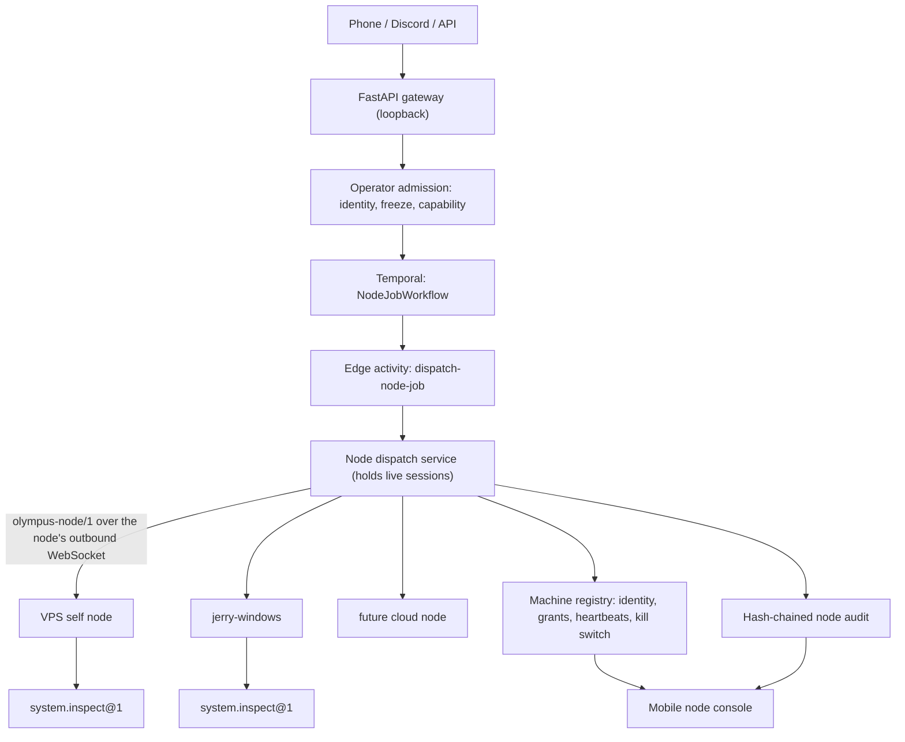

# Olympus Distributed Execution Node Mesh Design

**Status:** Approved

**Date:** 2026-08-01

**Owner:** Jerry

**Roadmap slice:** Slice 1N (execution-node foundation)

**Parent specifications:**

- `2026-07-28-agentic-vps-god-agent-design.md`
- `2026-07-29-olympus-implementation-roadmap-design.md`

## 1. Objective

Make **execution node** a first-class concept in Olympus.

Until now the parent specification described one machine that both decides and
executes, with temporary cloud workers as the only other execution surface.
This design generalizes that: the VPS remains the canonical always-on brain,
and any enrolled computer — the VPS itself, Jerry's Windows PC, a future cloud
instance — becomes a bidirectional execution node exposing typed capabilities.

From a phone, Jerry must eventually be able to command and observe work on
every one of those machines. This slice builds the foundation that makes that
possible without weakening a single invariant in Section 22 of the parent
specification.

## 2. Scope

### 2.1 Included

- The execution-node concept, its capability model, and its lifecycle.
- A machine registry that owns node identity, capability grants, connection
  state, and the dispatch kill switch.
- Single-use, short-lived, scope-bound enrollment tokens.
- A versioned, mutually authenticated worker protocol (`olympus-node/1`).
- Heartbeats, derived online/offline state, quarantine, and revocation.
- Dispatch integrated with the existing FastAPI gateway and owned by Temporal.
- Deduplicated, replay-safe job recovery across reconnects and retries.
- Progress streaming, cancellation, bounded output, and bounded artifacts.
- One enabled capability: `system.inspect@1`, bounded and non-mutating.
- A portable Python node agent, a Windows entrypoint, and an idempotent
  PowerShell installer.
- A mobile-friendly node console and its JSON API.
- A hash-chained node-mesh audit trail.

### 2.2 Excluded

These are named in the capability catalog as `reserved` so the taxonomy is
fixed, but none of them can be dispatched by this slice:

- Shell execution of any kind, including PowerShell.
- File read or write on a node.
- Claude or Codex sessions on a node.
- Browser control, including the existing agentic-chrome runtime.
- Desktop streaming and interactive takeover.
- Live Discord connectivity, WebAuthn deployment, or production credentials.
- PostgreSQL-backed persistence for the registry and audit chain.

### 2.3 Non-goals

- Making a node an authority. A node executes; it never decides.
- Making phone or Discord an execution node. They command and observe.
- A second orchestrator. Temporal remains the sole owner of workflow state.
- Peer-to-peer node communication. All coordination is through the control
  plane.

## 3. Invariants Preserved

This slice exercises the following Section 22 invariants directly.

| Invariant | How this design preserves it |
| --- | --- |
| 1. Input is not authority | Node-reported capabilities, health, and job output are untrusted input. The control-plane grant decides what may run. |
| 2. The orchestrator is not root | The node agent runs unprivileged, opens no listening socket, and can only execute registered capability providers. |
| 4. Temporal owns workflow state | Every node job is a `NodeJobWorkflow`. The dispatch service holds connections, never durable job truth. |
| 5. Every external effect is deduplicated | Every dispatch carries a deterministic dedupe key; nodes replay recorded results instead of repeating work. |
| 6. Every cycle and cost is bounded | Frame size, output size, artifact size and count, progress events, job deadline, concurrency per node, retry attempts, and enrollment lifetime all have hard limits. |
| 7. One canonical owner per datum | The registry owns identity and grants; Temporal owns execution state; the node owns only its private key and its result ledger. |
| 9. External content stays tainted | All node output is labelled `external-untrusted` and can never be labelled `control`. |
| 11. The system cannot widen its own constraints | Capability grants come from an operator-authorized enrollment token. A node cannot grant itself anything. |

The slice introduces no autonomous spending, no root command path, no
external-effect adapter, and no high-autonomy activation.

## 4. Architecture



### 4.1 Control plane

The VPS control plane is canonical for:

- node identity and public keys;
- capability grants;
- enrollment-token lifecycle;
- connection state and heartbeat liveness;
- dispatch admission and the mesh-wide kill switch;
- scheduling, through Temporal;
- the audit chain; and
- long-term memory, unchanged from the parent specification.

Nodes hold exactly two things the control plane does not: their own Ed25519
private key, and a bounded ledger of terminal job results used for replay.

### 4.2 Execution nodes

An execution node is any enrolled machine running the agent. Three kinds
exist: `control-plane-host` (the VPS itself), `workstation` (Jerry's PCs), and
`cloud-worker` (future burst capacity).

The VPS is deliberately modelled as a node rather than as a special case. It
enrolls through the same flow, speaks the same protocol over an in-process
channel, and is subject to the same grants. That keeps one code path and makes
"run this on the VPS" and "run this on my PC" the same operation.

### 4.3 Command and observation surfaces

Phone, Discord, and the HTTP API are command and observation surfaces. They
submit intent and read state. They are never execution nodes, hold no
capability, and never receive a dispatch frame.

### 4.4 Where dispatch lives

Live WebSocket sessions exist in the gateway process. The Temporal activity
that reaches them therefore runs in that same process, on its own task queue
(`olympus-node-edge-v1`).

This is a colocated Temporal worker, not a second orchestrator. The workflow
still owns the job; the activity carries exactly one attempt of it. When the
connection dies, the attempt fails and Temporal decides whether to retry.

## 5. Capability Model

A capability is a typed, versioned unit of node work named
`<namespace>.<verb>@<version>`. Each catalog entry declares its status, risk
class, whether it mutates, whether it will require Face ID, the trust label of
its output, and its runtime, output, and artifact bounds.

| Capability | Status | Risk | Mutates | Approval |
| --- | --- | --- | --- | --- |
| `system.inspect@1` | enabled | observe | no | no |
| `fs.read@1` | reserved | observe | no | no |
| `fs.write@1` | reserved | mutate-local | yes | yes |
| `shell.powershell@1` | reserved | privileged | yes | yes |
| `agent.claude@1` | reserved | mutate-local | yes | yes |
| `agent.codex@1` | reserved | mutate-local | yes | yes |
| `browser.session@1` | reserved | mutate-external | yes | yes |
| `desktop.stream@1` | reserved | observe | no | yes |
| `desktop.takeover@1` | reserved | privileged | yes | yes |

Reserved entries are refused at dispatch and cannot be granted by an
enrollment token. They exist in the catalog so the taxonomy, the risk
classification, and the roadmap are legible in code rather than only in prose.

### 5.1 Effective capability

```
effective = granted ∩ declared ∩ enabled-in-catalog
```

The grant is control-plane truth, set when the enrollment token is issued. The
declaration is what the node claims at handshake, and is untrusted: it can only
narrow the grant, never widen it. Unknown declared names are dropped rather
than rejected so a newer agent can connect to an older control plane.

### 5.2 Trust label

Every capability declares `external-untrusted` output. A node is a machine the
control plane cannot independently verify; a compromised node can lie about
anything it reports. Node output therefore propagates taint like any other
external content and can never control a privileged sink. The constructor for
a job outcome refuses the `control` label outright.

### 5.3 `system.inspect@1`

The one enabled capability reports a fixed set of host counters: operating
system identity, logical core count and load, total and available memory,
free space on the agent's own state directory, host uptime, and the agent's
own version and uptime.

It reads no file contents, no environment variables, no process list, no
network configuration, and no user data, and it never launches a subprocess.
Its implementation uses only the standard library.

## 6. Machine Registry

The registry is the canonical owner of node identity and admission.

Records carry the node identifier, display name, kind, platform,
architecture, agent version, public key, granted and declared capabilities,
labels, enrollment provenance, current session, last heartbeat, last reported
health, and quarantine or revocation state.

### 6.1 Derived state

State is derived from storage plus the current instant, never stored as a
mutable flag:

| State | Condition |
| --- | --- |
| `pending` | enrolled, never connected |
| `online` | a session is attached and its heartbeat age is within the expiry window |
| `offline` | no session, or heartbeat older than the expiry window |
| `quarantined` | administratively barred from dispatch, still observable |
| `revoked` | permanently retired; cannot connect or be restored |

A sweeper detaches sessions whose heartbeats stopped arriving and records the
expiry in the audit chain.

### 6.2 Enrollment-token lifecycle

1. An authorized operator requests a token for an exact node name, kind,
   platform, and capability grant.
2. The registry mints a token `olynode_<id>_<secret>` and stores only a
   domain-separated SHA-256 hash of the secret. The secret is returned once and
   never persisted or logged.
3. The token is single-use and expires within a bounded lifetime (default 15
   minutes, hard maximum 1 hour).
4. Redemption verifies the hash in constant time, the expiry, the consumption
   state, the revocation state, and the exact scope, then atomically marks the
   token consumed and creates the node record.
5. Reusing a consumed token with a different public key is refused as a replay.
   Reusing it with the *same* public key returns the original record, so a
   network retry during enrollment is safe.
6. Tokens can be revoked before redemption. Freezing the mesh also blocks
   issuance.

### 6.3 Kill switch

A single mesh-wide freeze flag with a monotonically increasing epoch.

- Freezing is idempotent and always available; it never requires more authority
  than the action it stops.
- Freezing refuses new admission at the gateway, refuses admission again inside
  the dispatch activity immediately before the frame is written, and cancels
  every job already in flight.
- Unfreezing requires naming the exact current freeze epoch, so a stale or
  guessed unfreeze cannot thaw the mesh. Face ID binding on unfreeze arrives
  with the approval slice.
- Quarantine and revocation are the per-node equivalents; revocation is
  irreversible.

## 7. Worker Protocol `olympus-node/1`

Nodes always dial out. The control plane never dials a node, and no Windows
port is opened. Reach is provided by Tailscale: the gateway binds loopback and
Tailscale Serve republishes it inside the tailnet.

### 7.1 Mutual authentication

The handshake authenticates both directions at the application layer, so it
does not depend on the transport for identity:

1. The node sends `hello` with its node identifier, agent version, platform,
   declared capabilities, a fresh nonce, and its resume state.
2. The control plane replies `challenge` with a session identifier, its own
   fresh nonce, its key identifier, and an Ed25519 signature over the protocol,
   session, node identifier, and **the node's nonce**.
3. The node verifies that signature against the control-plane public key it
   pinned at enrollment, and refuses an unexpected key identifier.
4. The node replies `attest` with an Ed25519 signature over the protocol,
   session, node identifier, **the server's nonce**, and a digest of its
   declared capabilities.
5. The control plane verifies it against the registered public key, attaches
   the session, and replies `session-ready` with the effective capabilities and
   the session bounds.

Each proof is bound to the other party's fresh nonce and to the session
identifier, so neither can be replayed into a different session. Binding the
capability digest into the node proof prevents a middlebox from editing the
declaration.

### 7.2 Frames

Node to control plane: `hello`, `attest`, `heartbeat`, `job-ack`,
`job-progress`, `job-artifact`, `job-result`.

Control plane to node: `challenge`, `session-ready`, `heartbeat-ack`,
`job-dispatch`, `job-cancel`, `session-close`.

Frames are JSON, validated against a discriminated union with unknown fields
forbidden, and bounded at 256 KiB.

### 7.3 Bounds

| Bound | Value |
| --- | --- |
| Frame size | 256 KiB |
| Job output | capability-declared, 16 KiB for `system.inspect@1` |
| Progress events per job | 200 |
| Artifacts per job / artifact size | 8 / 1 MiB |
| Concurrent jobs per node | 4 |
| Declared capabilities | 32 |
| Heartbeat interval / expiry | 15 s / 45 s |
| Handshake deadline | 10 s |

Output exceeding its bound is redacted first and then truncated, and the
result is flagged as truncated. Redaction before truncation ensures a cut can
never split a credential open.

### 7.4 Deduplication and replay-safe recovery

Every dispatch carries `dedupe_key = SHA-256(job_id, capability, parameters)`.

The node keeps a bounded ledger of terminal results keyed by that value. A
re-dispatch — after an activity retry, a reconnect, or a control-plane restart
— returns the recorded result marked `replayed`, without running the work
again. A duplicate dispatch of a job still running attaches to the same
execution and receives the same result. Cancelled jobs are deliberately not
recorded, so a retry after cancellation runs fresh.

This is the node-mesh instance of parent Section 15.1: the effect is
idempotent by deterministic identity plus a result ledger.

### 7.5 Reconnect

On disconnect the session is torn down and every job awaiting it fails with
`session-closed`, which Temporal treats as retryable. The agent reconnects with
bounded exponential backoff and jitter, keeping its ledger. The retried attempt
re-dispatches the same dedupe key and replays. A reconnecting node displaces
its own previous session; a stale session can never detach a newer one.

## 8. Dispatch Path

1. A command arrives at the gateway and is authorized.
2. Admission checks the capability is enabled and the mesh is not frozen, then
   starts `NodeJobWorkflow` with the job identifier as the workflow identifier.
3. The workflow schedules `dispatch-node-job` on the edge queue, bounded by
   schedule-to-close, start-to-close, heartbeat timeout, and a maximum of two
   attempts, matching the parent worker-recovery bound.
4. The activity selects the node, re-checks the freeze, writes the dispatch
   frame, and awaits the terminal frame while relaying progress as heartbeats.
5. Progress events update the job record the console reads.
6. The terminal outcome is redacted, audited, and returned to the workflow.
7. Cancellation is a workflow signal; the workflow cancels the attempt, the
   activity sends `job-cancel`, and the workflow returns a declared `cancelled`
   outcome rather than a lost execution.

Progress delivery is best effort and isolated: a failing progress consumer can
never tear down a connection other jobs depend on.

## 9. Observation Surface

`GET /v1/nodes` returns every machine with its derived state, effective
capabilities, heartbeat age, health, and the freeze state.
`GET /v1/nodes/jobs` returns recent jobs with progress counts.
`GET /v1/nodes/audit` returns the hash chain and whether it verifies.

`GET /ui/nodes` serves a self-contained, mobile-first console: no external
assets, no embedded data, no embedded credential. The operator credential is
entered once and held in the tab's session storage; every data call is
separately authorized. Serving the shell reveals nothing.

## 10. Audit

Every security-relevant decision appends an event carrying sequence, event
identifier, version, timestamp, actor, action, decision, stable reason code,
node and job identifiers, a redacted payload, that payload's digest, the
previous event hash, and its own hash over the canonical body.

Payloads are redacted before they are hashed, so a secret cannot enter the
chain even in digest form. The chain detects modification, reordering, and
truncation. PostgreSQL becomes its canonical owner in the persistence slice;
this slice makes no claim of off-host immutability.

## 11. Threat Model Summary

| Threat | Control |
| --- | --- |
| Stolen enrollment token | Single-use, short-lived, scope-bound, hash-stored, revocable, refused while frozen |
| Replayed enrollment | Consumption is atomic; replay with a different key is refused and audited |
| Node lies about capabilities | Effective set is the intersection with the operator grant |
| Node lies about health or output | All node output is `external-untrusted` and cannot reach a privileged sink |
| Node impersonation | Ed25519 proof over a server-chosen nonce and the session identifier |
| Rogue control plane | The node verifies a control-plane signature over its own nonce against a key pinned at enrollment |
| Handshake replay | Both proofs bind both nonces and the session identifier |
| Output flooding | Frame, output, artifact, and progress bounds, enforced on both ends |
| Secret leakage | Redaction on the node before sending, again on receipt, and again before audit |
| Privilege escalation from a node | Only registered capability providers execute; no shell path exists |
| Lost node key | Quarantine, then irreversible revocation |
| Lost control-plane key | Every node refuses the new key; all must re-enroll — a loud failure, not a silent downgrade |

### 11.1 Residual risks

- The registry and audit chain are in-process and are lost on restart.
- No off-host audit export yet.
- Unfreeze is not yet bound to a Face ID assertion.
- The operator credential is still the development shared token.
- Transport identity relies on Tailscale plus the application-layer
  control-plane key, not on a pinned TLS certificate.

Each is closed by a named later slice.

## 12. Testing Strategy

- Unit and property tests for the capability catalog, capability
  normalization, signatures, enrollment secrets, dedupe keys, frame bounds,
  frame validation, redaction, and the audit chain.
- Registry tests for enrollment expiry, replay, revocation, scope mismatch,
  declaration narrowing, heartbeat expiry, session replacement, the admission
  matrix, freeze monotonicity, and epoch-bound unfreeze.
- Protocol tests for mutual authentication, forged proofs, unexpected key
  identifiers, unsupported versions, and revoked nodes.
- Dispatch tests for progress streaming, cancellation, deduplicated replay,
  reconnect recovery, session loss, output bounds, secret redaction,
  artifacts, concurrency bounds, and freeze behaviour.
- Workflow tests for activity bounds, retry within the recovery bound,
  non-retryable refusals, and cancellation producing a declared outcome.
- Gateway tests for authorization, refusal mapping, admission before durable
  state, console isolation, and audit exposure.
- An end-to-end test over real HTTP, a real WebSocket, and a real Temporal
  server proving enrollment, dispatch, progress, result, audit, reconnect, and
  the kill switch.

## 13. Acceptance Gate

This slice is accepted when:

1. Only an authorized operator can issue grants, dispatch work, or change mesh
   control state.
2. An enrollment token works exactly once, within its lifetime, for its exact
   scope.
3. Both directions of the handshake are authenticated and replay-resistant.
4. A node's declaration cannot widen its grant.
5. A node with an expired heartbeat is not dispatchable.
6. A re-dispatched job replays rather than repeating work.
7. Cancellation reaches the node and yields a declared terminal outcome.
8. Output, artifacts, and progress are bounded, and secrets are redacted.
9. Freezing refuses new work, stops work in flight, and can only be cleared by
   naming the exact freeze epoch.
10. The audit chain verifies and contains no credential material.
11. No shell, file, browser, or desktop capability can be dispatched.
12. No external effect, live Discord connection, or production mutation occurs.

Passing this gate authorizes designing the next capability slice. It does not
authorize deployment, Face-ID-free mutation, or any reserved capability.

## 14. Next Slices

Each of the following requires its own design, a Face-ID binding, and signed
policy before activation.

1. **`fs.read@1`** — bounded reads under an allowlisted root. New risk:
   exfiltration through path traversal and symlinks.
2. **`shell.powershell@1`** — an allowlisted, argument-validated operation
   registry mirroring the existing host root broker, never a free-form shell.
   New risk: argument injection and unbounded effect.
3. **`fs.write@1`** — atomic writes with backups under an allowlisted root.
   New risk: irreversible local damage.
4. **`agent.claude@1` / `agent.codex@1`** — isolated worktrees, bounded
   sessions, quota-aware routing. New risk: an agent on the node inherits the
   node's authority.
5. **`browser.session@1`** — wraps the existing agentic-chrome runtime rather
   than replacing it: admission through its verify checks, exclusivity through
   its flock lease, and drive through its loopback CDP endpoint. The node agent
   becomes the only process that touches that endpoint, and the control plane
   never sees raw CDP. New risk: the browser holds live authenticated sessions,
   so every page is untrusted input with real authority behind it.
6. **`desktop.stream@1`** — read-only framebuffer streaming with explicit
   consent and bounded retention. New risk: continuous capture of everything on
   screen, including other people's data.
7. **`desktop.takeover@1`** — interactive input injection. New risk: complete
   control of the machine; requires a visible local indicator, a hard time
   bound, and Face ID per session.

Persistence, off-host audit export, Face-ID-bound unfreeze, and lease-backed
operator identity are prerequisites carried by the existing roadmap slices and
are not duplicated here.
